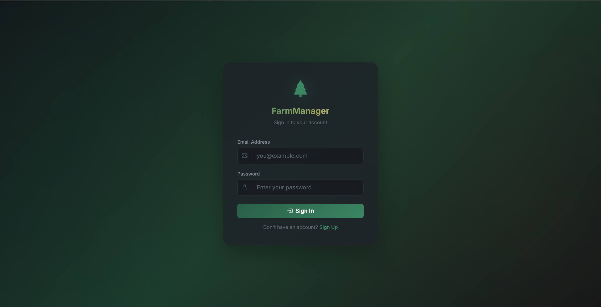
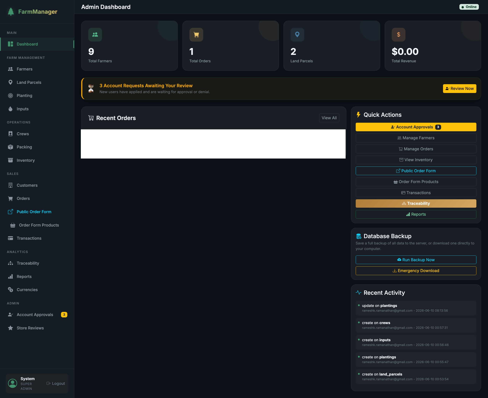

# FarmManager - Full-Stack Farm Management Platform

> A production-ready web application built from scratch for managing end-to-end farming operations - from land and crops to inventory, orders, customers, and financials.

🌐 **Live App:** [your-domain.com/farm_app](https://your-domain.com/farm_app)

> _Full source is proprietary. Selected architecture files are included in this repository to demonstrate code structure and quality._

---

## Screenshots

| Login Page | Admin Dashboard |
|---|---|
|  |  |

---

## What It Does

FarmManager is a multi-role SaaS-style platform that handles the full operational lifecycle of a farming organization:

- **Farmer Portal** - each farmer manages their own land parcels, planting cycles, inputs, crew, and packing batches
- **Admin Dashboard** - organization-wide oversight with account approvals, reports, and audit logs
- **Organization Admin** - mid-tier role for managing a team of farmers under one organization
- **Public Store** - customer-facing product catalog and order form with PayPal/Zelle payment support
- **Traceability** - full farm-to-order chain tracking (QR code ready)
- **Automated Reports** - daily email summaries sent via cron job
- **REST API** - full CRUD endpoints for all 11 modules

---

## Tech Stack

| Layer | Technology |
|---|---|
| **Backend** | PHP 8.2, custom MVC framework (built from scratch) |
| **Database** | MySQL 8.0, PDO with prepared statements |
| **Frontend** | HTML5, CSS3, JavaScript, Bootstrap 5 |
| **Auth** | bcrypt (cost 12), session management, CSRF protection |
| **Email** | PHPMailer via Gmail SMTP |
| **DevOps** | Docker + docker-compose, cron jobs, health monitor |
| **Hosting** | Shared Linux hosting with `.htaccess` routing |

---

## Architecture

Built as a custom MVC framework - no Laravel, no Symfony. Everything from routing to auth to CSRF protection was written from the ground up.

```
farm-manager/
├── core/               # Custom MVC framework
│   ├── App.php         # Bootstrapper - loads config, routes, error handler
│   ├── Router.php      # Regex-based URL router with method + middleware support
│   ├── Controller.php  # Base controller (view rendering, redirects, flash)
│   ├── Model.php       # Base model (PDO query builder)
│   ├── Auth.php        # Session-based auth with role checking
│   ├── CSRF.php        # CSRF token generation and validation
│   ├── Mailer.php      # PHPMailer wrapper for transactional emails
│   └── Logger.php      # File-based structured logger
├── controllers/        # 20 controllers (one per module)
├── models/             # 14 models
├── views/              # 50+ view templates
├── api/                # REST API entry point
├── database/           # Schema + migration files
└── docker/             # Dockerfile + docker-compose
```

---

## Key Engineering Highlights

### Custom Router
Built a regex-based router that supports named parameters, HTTP method filtering, and middleware (auth guard, role checks) - without any external dependencies.

### Role-Based Access Control
Three-tier role system: `farmer` → `org_admin` → `admin`. Each role has its own dashboard and restricted route access enforced at the controller level via the `Auth` core class.

### Security
- CSRF tokens on every POST form
- bcrypt password hashing (cost factor 12)
- SQL injection prevention via PDO prepared statements everywhere
- Session regeneration on login/logout
- Login attempt logging with audit trail

### Automated Operations
- Daily report cron job emails order/revenue summaries to the manager
- Health monitor script checks uptime and emails alerts on failure
- Database backup script runs on schedule and emails CSV exports

### REST API
Full CRUD API for all 11 modules following REST conventions. Stateless, JSON responses, protected by session auth.

---

## Database Design

11 relational tables covering the full farming operation lifecycle. See [`database/schema.sql`](database/schema.sql) for the full schema.

Key tables: `users`, `farmers`, `land_parcels`, `plantings`, `inputs`, `crews`, `crew_tasks`, `packing_batches`, `inventory`, `orders`, `order_items`, `customers`, `transactions`, `audit_logs`, `store_reviews`

---

## Selected Source Files (Included in This Repo)

| File | What It Shows |
|---|---|
| [`database/schema.sql`](database/schema.sql) | Full relational database design |
| [`core/Router.php`](core/Router.php) | Custom regex router with middleware support |
| [`core/Auth.php`](core/Auth.php) | Session-based auth and role enforcement |
| [`core/Model.php`](core/Model.php) | PDO-based base model / query builder |
| [`core/CSRF.php`](core/CSRF.php) | CSRF token generation and validation |
| [`controllers/AuthController.php`](controllers/AuthController.php) | Login, register, approval flow with email |
| [`api/index.php`](api/index.php) | REST API entry point |
| [`docker/docker-compose.yml`](docker/docker-compose.yml) | Local dev environment setup |

---

## Local Setup (Docker)

```bash
git clone https://github.com/YOUR_USERNAME/farm-manager.git
cd farm-manager
cp config/database.example.php config/database.php
cp config/mail.example.php config/mail.php
cp config/secrets.example.php config/secrets.php
# Fill in your credentials in each file

cd docker && docker-compose up -d
# App available at http://localhost:8080
```

**Demo login:**
- Admin: `admin@farmapp.com` / `admin123`
- Farmer: `john@farm.com` / `farmer123`

---

## Built By

Navaneetha Krishnan - Full-Stack Developer  
[LinkedIn](https://linkedin.com/in/YOUR_LINKEDIN) · [GitHub](https://github.com/YOUR_USERNAME)
